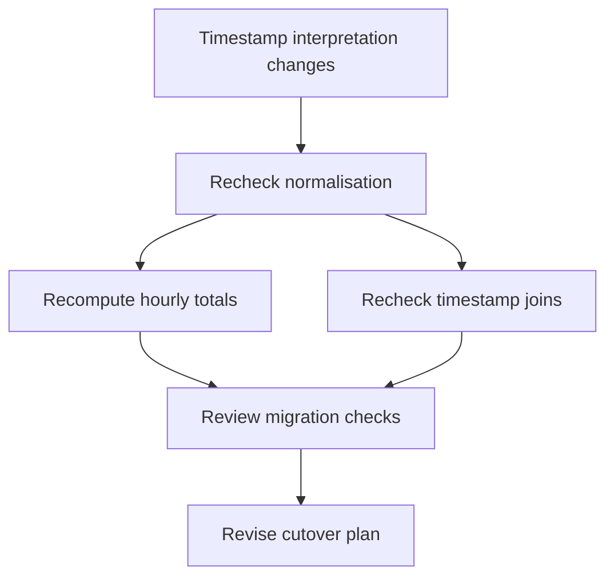

# Proposal: a Lean-backed harness for long-horizon reasoning

**Status:** proposed; design discussion, no implementation commitment.  
**Date:** 2026-09-08.  
**Repository recommendation:** review this proposal in ReSchema; implement an
approved pilot in a separate repository, with ReSchema as its first external domain
adapter. The new project's name remains open.

## Summary

Build a harness that lets an agent accumulate an executable, checkable model
of a project across many reasoning sessions. Preserve observations, explicit
assumptions, programs, proofs, and decisions together. Track their dependencies
so new evidence can trigger targeted recomputation and reconsideration.

Use **Lean 4 as the primary language for the formal project model**: definitions,
executable functions, specifications, conditional theorems, and reusable proofs.
Keep empirical evidence and the agent's current justification for applying a
theorem in a separate, versioned ledger. A small controller owns persistence,
verification, budgets, and task completion.

The research hypothesis is that a fixed model can complete longer, more
interdependent tasks when it can reuse checked reasoning and recover from
changed assumptions without reconstructing its whole argument in prose.
Measure whether this saves more error and rework than formalisation costs.

This proposal adds no Lean dependency, runtime behaviour, or new acceptance
path to ReSchema. Its C models, existing validators, entropy policy, MCP
contracts, and benchmark accounting remain the baseline for the experiment.

## Motivation and scope

An agent may discover a useful rule yet lose it during context compaction,
silently strengthen a tentative assumption, or revise an input without revisiting
dependent conclusions. More persistent prose alone does not ensure that those
conclusions remain applicable.

Executable representations offer two useful properties: they preserve learned
structure, and they apply that structure repeatedly through computation.
Formal proofs can additionally establish that particular conclusions follow
from precisely stated premises. Neither property establishes that empirical
premises accurately describe the current world.

Schema provides a motivating example of executable world models checked
against observed game transitions. PRO-LONG supplies related evidence for
complete, programmatically accessible interaction histories. These results
concern ARC-AGI-3's public games; they motivate testing this architecture beyond
that setting. They do not establish universal transfer, the necessity of Lean,
or a solution to arbitrary long-horizon reasoning. See [references](#references).

The target is a reusable workflow across domains with different sources of
evidence and different standards of verification. Suitable initial tasks
include reverse engineering, data transformations, and repository migrations.
Research and planning can use partial formal models while retaining explicit
uncertainty and human judgment where necessary. A full simulator of every task
is neither assumed nor required.

## Relationship to ReSchema and repository placement

ReSchema already separates experiments, candidate implementations, validation,
structured divergences, and reusable accepted work. Its architecture and
deduction cache are the starting point for this proposal, not evidence that the
general machinery is already implemented.

| ReSchema concept | Proposed general counterpart |
| --- | --- |
| Original binary | Domain environment or source of evidence |
| Executable C candidate | Versioned executable model and formal specification |
| Probe and recorded trace | Agent-visible observation with inputs and provenance |
| Differential validator | Domain check or proof checker with an explicit scope |
| Accepted function | Reusable artifact with recorded validation dependencies |
| Structured divergence | Counterexample, failed requirement, or unresolved obligation |
| Family deduction cache | Project knowledge indexed by provenance and applicability |
| Task ledger | Durable objectives, attempts, budgets, decisions, and completion state |

The current `TaskStore` depends on the binary corpus and its validators;
`memory.py` uses family-scoped JSONL records. The architecture also documents
a capped recent journal and function probes that do not persist a trace.
Those are domain-specific choices, not a complete general event store to
extract unchanged. Existing `verified_fact` labels mean acceptance under the
current judge; the new design must retain that scope rather than interpret
them as unrestricted mathematical truth.

**Recommendation:** keep ReSchema focused on reverse engineering. Place the
pilot's Lean toolchain, generic ledger, and controller in a separate repository
once its initial experiment is agreed. Review the proposal here because it
derives from ReSchema and needs to preserve its experimental baseline. Begin
with an adapter over ReSchema's public interface; extract shared packages only
after two working domain adapters demonstrate a stable boundary.

This is a parallel research direction, not a new prerequisite for the existing
[roadmap](../roadmap.md). The guided-tenacity work in issues
[#127](https://github.com/Lewdwig-V/reschema/issues/127),
[#128](https://github.com/Lewdwig-V/reschema/issues/128), and
[#129](https://github.com/Lewdwig-V/reschema/issues/129) remains separately
scoped. This document does not implement those issues or combine their
experimental conditions.

## Durable project state

Treat the project as a build system for knowledge: artifacts name the inputs
and assumptions on which they depend, and revisions identify what needs to be
checked again. Store immutable versions and append events; derive the current
view from those records.

| Record | Minimum information |
| --- | --- |
| Objective | User requirement, completion checks, scope, authorised revision |
| Observation | Source, acquisition operation and inputs, raw result or blob reference, time, environment version |
| Claim | Precise statement, interpretation, supporting and conflicting observations, scope, explicit assumptions |
| Artifact | Content digest, language, definitions or target declaration, input and dependency versions |
| Validation | Exact artifact and target, checker identity and version, method, outcome, conditions, evidence references |
| Decision or action | Objective, dependencies, preconditions, intended effect, attempt identifier, observed outcome |

The controller records every agent-visible operation and observation. It keeps
private validator inputs and unrevealed reference data outside the agent's
readable store. The agent can propose interpretations and corrections; it
cannot rewrite the recorded tool result. An observation proves that a source
returned something at a particular time, not that the source was correct.

Keep **validation** separate from **current applicability**. A formal proof
may remain checked while the evidence supporting an empirical premise becomes
disputed. A passing test remains a historical result even when its input data
or environment is superseded. Review-based judgments retain their method and
reviewer provenance; they do not become formal proofs.

The initial implementation can use SQLite transactions for the event ledger
and dependency records, with content-addressed files for larger artifacts.
Use a single controller as writer. Multi-agent coordination and concurrent
mutation are deferred until the serial recovery semantics work.

## Lean's role and the verification boundary

Lean can express executable functions and the properties expected of them in
one language. Use it for typed project entities, constraints, transformations,
state transitions, conditional deductions, and checked witnesses for plans.
Require a computable interface for artifacts used in simulation or search;
not every mathematical definition in Lean is executable.

The controller and domain adapters may use Python and existing tools for
orchestration, data acquisition, and specialised computation. A result produced
outside Lean is evidence or an untrusted candidate until the relevant checker
validates it. A theorem about a Lean function does not automatically verify a
separate Python or C implementation, its parser, or its foreign-function bridge.

### Explicit hypotheses, not invented facts

Represent empirical assumptions as theorem parameters and ledger claims. For
example, prove that a transformation preserves identifier uniqueness **if**
the source identifiers are unique and its mapping is injective. Separately
record what establishes those premises for a particular input snapshot.

Withdrawing support for a premise does not invalidate the conditional theorem.
It prevents the controller from presenting its application to the current
project as established. Alternative models can coexist in distinct contexts;
the controller must not silently combine their incompatible assumptions.
General consistency checking of arbitrary assumptions is not promised.

### Proof acceptance

A proof attempt is a candidate artifact. The verifier owns the expected target
and trusted environment, and records a result only for that exact combination.
The implementation must:

1. Pin Lean, imported libraries, the formal target, and the permitted foundational
   axioms. Record transitive logical dependencies.
2. Run agent-authored elaboration, tactics, and executable code in a bounded,
   isolated worker. Proof generation may execute code; it has no write access
   to the verifier's acceptance records or trusted artifacts.
3. Independently recheck the resulting declaration against the verifier-owned
   target and environment. Inspect actual dependencies, not just source text
   or a successful process exit.
4. Refuse proof acceptance for dependencies on `sorryAx`, unapproved axioms, or
   an expanded trust boundary. Any compiler-backed shortcut or external solver
   must have an explicit validation policy; proof certificates checked by the
   approved verifier are preferable to trusting a solver's assertion.

Ordinary compilation and typechecking do not establish an unspecified
behavioural property. The target statement must be reviewed against the
objective and tested against independent examples where possible. The agent
cannot satisfy a task by silently weakening its specification. Formal target
changes create a new version and require the task's established review policy.

A failed tactic, timeout, or incomplete proof means **unproved**, not false.
Keep counterexamples, unmet empirical checks, unproved obligations, and
infrastructure errors distinct in agent-facing feedback.

### Progressive formalisation

Allow exploration with conjectures, executable models, and regression tests.
Prioritise proofs for components whose results are reused or whose failure
would invalidate expensive downstream work. A proved component can become a
building block even when other parts of the project remain empirical.

The stopping condition must specify the required assurance for each deliverable.
It must not require proving every exploratory claim, or award completion merely
because some proof has succeeded. Proof construction cost is part of the
experiment, especially for small models.

## Dependency tracking and changed assumptions

Dependencies include program inputs, definitions, theorem premises, objective
versions, and evidence used to apply a result. Instrument file and tool reads
where possible; ask the model to declare semantic dependencies that cannot be
observed automatically. This gives traceability, not a guarantee that every
conceptual dependency has been discovered.

When a dependency changes, mark affected applications and decisions stale
before permitting their reuse. Recompute pure derivations, rerun applicable
checks, and ask the agent to reconsider choices that depended on changed
results. If dependency capture is uncertain, use a conservative wider review.
An empirical discrepancy becomes a regression case only with its original
environment and preconditions attached; a real environment change must not
be mislabelled as a regression of the new model.

For example, an agent models timestamps as UTC, normalises records, calculates
hourly totals, and builds a migration plan. A later observation establishes
that one source uses local time:

Historical calculations remain reproducible under their original assumptions.
Independent artifacts remain usable. A theorem about the normaliser remains
valid for its formal definition; the claim that the definition matches the
source's timestamps needs new support.

The system must also discover that stale evidence exists. Domain adapters
declare what can be versioned, refreshed, or reobserved. Recheck relevant
external preconditions before consequential actions and task completion;
a dependency graph alone does not detect changes in an unobserved world.

## Controller and recovery

The controller exposes a small set of operations through an MCP server or
equivalent transport: open project, observe, propose artifact, validate,
perform authorised action, and inspect state. These are proposed capabilities,
not changes to ReSchema's five-tool contract. Transport alone does not provide
durable execution; the host runner owns scheduling and resumption.

Each iteration:

1. Load the objective, relevant supported artifacts, pending obligations,
   stale dependencies, and cumulative budget. Leave the complete permitted
   history queryable by code.
2. Choose a question that blocks progress. State a hypothesis or proposed
   change and the observation or check that would distinguish its outcomes.
3. Execute the investigation or check and persist its result, including
   unsuccessful attempts and structured errors.
4. Update support and applicability, propagate staleness, and recompute affected
   pure artifacts. Feed concrete discrepancies or missing obligations back to
   the agent.
5. Check the whole objective. Continue, change approach, surface a necessary
   clarification, or finish with the evidence required by the task contract.

Guided tenacity uses observed progress: what still holds, what changed, which
specific obligation remains, and whether another attempt could add information.
Repeated identical failures trigger a different investigation or a bounded stop.
Changing context or restarting an agent never resets the project's budget.
Any continuation policy is a separately measured treatment, not an invisible
addition to a baseline run.

Context compaction produces a view of durable state, not a replacement for it.
A new session can obtain the same objective, artifact versions, evidence,
obligations, and action history without trusting a narrative summary as fact.

Commit state transitions and their dependency updates transactionally. Record
an external action attempt before issuing it, using an idempotency key where
the adapter supports one. A crash after dispatch but before recording success
leaves an **unknown outcome**. Reconcile with the external environment before
retrying; if that cannot be done safely, stop that action for intervention.
Replaying history may rerun pure checks but must not blindly repeat side
effects. Arbitrary APIs do not provide an exactly-once execution guarantee.

## Smallest useful pilot

Build one complete vertical slice before a general framework:

1. **Ledger and restart:** one agent, one writer, versioned objectives and
   evidence, reproducible artifacts, and an honest cumulative budget.
2. **Lean gate:** a small approved library, explicit targets and hypotheses,
   bounded proof attempts, independent checking, and separate validation and
   applicability records.
3. **Changed-premise recovery:** a controlled data-transformation task with a
   revised timestamp or identifier assumption. Demonstrate targeted staleness,
   recomputation, and correct completion after a fresh-session restart.
4. **ReSchema adapter:** call its public tools, retain only exposed evidence,
   and preserve its existing task-completion and accounting semantics. C stays
   the binary model; Lean may express additional contracts, without substituting
   for the existing differential judge or claiming to verify the C translation.
5. **Third task family:** add a repository migration with changed
   requirements and repeat the same recovery exercise. This tests whether the
   abstraction survives outside the initial fixture and reverse engineering.

No multi-agent swarm, universal ontology, learned controller, weight updates,
new theorem-proving foundation, or arbitrary external writes are needed for
this pilot. Start the operational recovery test against a controlled fake
service with observable outcomes.

## Evaluation and decision criteria

Use the same fixed model, task instances, source access, inference settings,
and execution tools within each comparison. Measure these conditions:

| Condition | Added support |
| --- | --- |
| A | Ordinary agent workspace and prose notes |
| B | A complete queryable observation/action log |
| C | B plus executable models and regression checks |
| D | C plus dependency tracking and applicability invalidation |
| E | D plus the Lean formalisation and proof workflow |

Keep the tool palette, including Lean where applicable, equally available;
vary the workflow and enforcement policy. Record whether a baseline agent
spontaneously uses those tools. Additional tool-removal ablations can then
separate access from policy. Pin prompts and controller behaviour; do not
silently add retries or extra reasoning to the strongest condition.

Run repeated trials with fresh workspaces on development tasks and a separate
held-out task set. Include both frontier and small models. Predeclare token,
tool, proof-check, and total cost/time caps; report quality versus actual total
cost because equal model tokens do not imply equal prover or execution cost.
Charge every attempt, including failed formalisation, resumed sessions, and
unsuccessful runs. Avoid retained-best-run-only reporting.

Tasks should contain interdependent work, not merely many independent short
questions. Include a forced fresh-session restart, delayed contradictory
evidence, a changed requirement, and a failed approach worth revisiting after
its preconditions change. Use an external task evaluator separate from the
agent's own generated checks. Pin the evaluator version and keep its private
data private.

Report:

- Final task success under the declared evaluation method.
- Stale conclusions used after contrary evidence became available.
- Correct recovery after restart and changed assumptions.
- Human interventions and unresolved external action outcomes.
- Repeated experiments and invalidated work that required rebuilding.
- Total tokens, tool/prover work, elapsed time, and cost per successful task.
- Formalisation errors: a checked theorem whose statement misses the intended
  requirement, or an application lacking support for its premises.

Use development runs to set the minimum useful improvement and acceptable cost
increase, then freeze them before the held-out comparison.
Advance the Lean design only if it improves success, recovery, or reuse enough
to justify its cost over D on more than one task family. If B or C captures
most of the benefit, simplify the controller and retain Lean for obligations
where it adds measurable value. If results are inconclusive, gather more
evidence before expanding the architecture.

## Required failure cases for a future implementation

These are proposed acceptance tests, not tests delivered by this documentation PR.
Each gate should have a negative witness, following ReSchema's conventions.

| Failure case | Required behaviour |
| --- | --- |
| A summary turns a hypothesis into a fact | Applicability still requires the recorded supporting evidence |
| Evidence supporting one premise is superseded | Dependent applications become stale; the conditional theorem remains checked |
| A supposedly irrelevant input actually changes output | Dependency audit detects the omission or triggers conservative review |
| The agent proves a weaker statement | Verifier rejects it against the pinned target |
| A proof uses `sorry` or an unapproved axiom indirectly | Transitive dependency checking refuses proof acceptance |
| A tactic times out on a true conjecture | Outcome is unproved, with budget charged; no false counterexample |
| One component passes while the project is incomplete | No overall task-complete result |
| A replayed check used an old environment | Validation remains scoped to that environment |
| The controller crashes after an external action | Outcome is reconciled before any retry |
| An agent session restarts after exhausting its budget | Counters and limits persist |
| A private judge returns limited feedback | Only that exposed feedback enters the agent's evidence store |

## Decisions to settle before implementation

- Choose the first data-transformation fixture and its independent evaluator.
- Select the initial Lean library, validation procedure, and permitted trust
  boundary, including how external computation returns checkable evidence.
- Define a task's required assurance and who may revise its formal targets.
- Decide the initial dependency-capture mechanism and conservative fallback.
- Agree the pilot's cost limits and repository name.

## References

- [ReSchema architecture](../../ARCHITECTURE.md),
  [deduction cache](../../src/reschema/memory.py), and
  [benchmark protocol](../benchmark-protocol.md): current boundaries and
  experimental discipline; not a claim that this proposal is implemented.
- [Schema project report](https://schema-harness.github.io/): executable game
  models and empirical checking on ARC-AGI-3 Public. Reported results are
  motivation for a new experiment, not estimates of general-task performance.
- [PRO-LONG: Programmatic Memory Enables Long-Horizon Reasoning, v2](https://arxiv.org/html/2607.20064v2):
  programmatic access to complete interaction histories, with ablations on
  ARC-AGI-3 Public. Its memory mechanism does not establish that formal proofs
  are necessary.
- [The Lean Language Reference](https://lean-lang.org/doc/reference/latest/)
  and [Axioms and Computation](https://lean-lang.org/theorem_proving_in_lean4/Axioms-and-Computation/):
  the programming/proof model and logical dependencies. A prototype must pin
  concrete versions rather than depend on the moving `latest` documentation.
