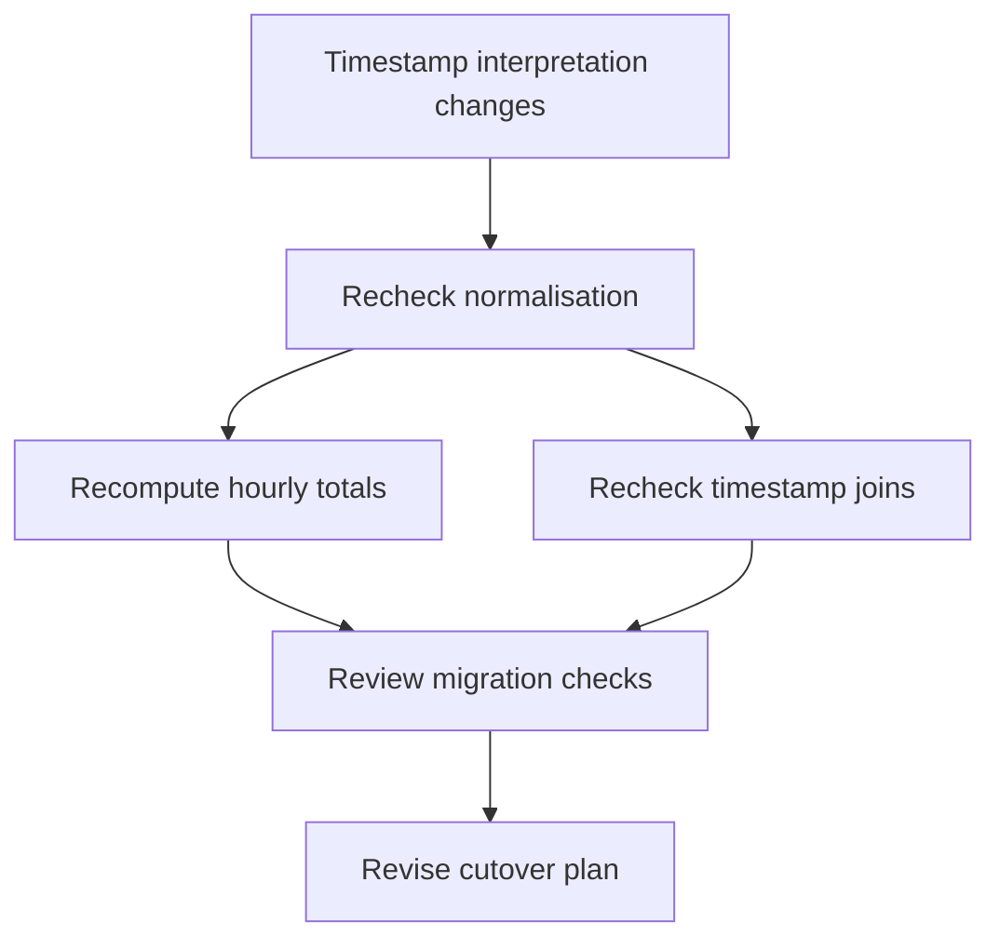

# Proposal: a Lean-backed harness for long-horizon reasoning

**Status:** proposed; design discussion, no implementation commitment.  
**Date:** 2026-09-08.  
**Updated:** 2026-09-18 — include a bounded Dream-RSI-style pilot experiment.

**Repository recommendation:** review this proposal in ReSchema; implement an
approved pilot in a separate repository, with ReSchema as its first external domain
adapter. The new project's name remains open.

## Summary

Build a harness that lets an agent accumulate an executable, checkable model
of a project across many reasoning sessions. Preserve observations, explicit
assumptions, programs, proofs, and decisions together. Track their dependencies
so new evidence can trigger targeted recomputation and reconsideration.

Use **Lean 4 as the primary language for the formal project model**: definitions,
executable functions, specifications, conditional theorems, and reusable proofs.
Keep empirical evidence and the agent's current justification for applying a
theorem in a separate, versioned ledger. Reuse LangGraph for durable orchestration
and mini-swe-agent for bounded working sessions. The new controller implements
evidence semantics, dependency invalidation, verification, budgets, and task
completion on those foundations. Design a replaceable exploration policy and
replayable investigation records from the start. After the fixed-policy baseline
works, include a bounded Dream-RSI-style experiment that improves search scheduling
through recorded outcomes. Evaluate AutoSaddler later for broader harness
optimisation against the same fixed task contract.

Distinguish rules, which permit recorded exceptions, from gates, which require
checked evidence before a protected transition. Preserve that distinction in
the task contract, stored state, and execution boundary.

The research hypothesis is that a fixed model can complete longer, more
interdependent tasks when it can reuse checked reasoning and recover from
changed assumptions without reconstructing its whole argument in prose.
Measure whether this saves more error and rework than formalisation costs.
Separately test whether replay-based search improvement adds to those gains.
The pilot must distinguish the benefits of knowledge management, search policy,
and their combination; neither hypothesis depends on changing model weights.

This proposal adds no Lean dependency, runtime behaviour, or new acceptance
path to ReSchema. Its C models, existing validators, entropy policy, MCP
contracts, and benchmark accounting remain the baseline for the experiment.

## Motivation and scope

An agent may discover a useful regularity yet lose it during context compaction,
silently strengthen a tentative assumption, or revise an input without revisiting
dependent conclusions. More persistent prose alone does not ensure that those
conclusions remain applicable.

Executable representations offer two useful properties: they preserve learned
structure, and they apply that structure repeatedly through computation.
Formal proofs can additionally establish that particular conclusions follow
from precisely stated premises. Neither property establishes that empirical
premises accurately describe the current world.

Schema provides a motivating example of executable world models checked
against observed game transitions. PRO-LONG supplies related evidence for
complete, programmatically accessible interaction histories. These results
concern ARC-AGI-3's public games; they motivate testing this architecture beyond
that setting. They do not establish universal transfer, the necessity of Lean,
or a solution to arbitrary long-horizon reasoning. See [references](#references).

The target is a reusable workflow across domains with different sources of
evidence and different standards of verification. Suitable initial tasks
include reverse engineering, data transformations, and repository migrations.
Research and planning can use partial formal models while retaining explicit
uncertainty and human judgment where necessary. A full simulator of every task
is neither assumed nor required.

## Relationship to ReSchema and repository placement

ReSchema already separates experiments, candidate implementations, validation,
structured divergences, and reusable accepted work. Its architecture and
deduction cache are the starting point for this proposal, not evidence that the
general machinery is already implemented.

| ReSchema concept | Proposed general counterpart |
| --- | --- |
| Original binary | Domain environment or source of evidence |
| Executable C candidate | Versioned executable model and formal specification |
| Probe and recorded trace | Agent-visible observation with inputs and provenance |
| Differential validator | Domain check or proof checker with an explicit scope |
| Accepted function | Reusable artifact with recorded validation dependencies |
| Structured divergence | Counterexample, failed requirement, or unresolved obligation |
| Family deduction cache | Project knowledge indexed by provenance and applicability |
| Task ledger | Durable objectives, attempts, budgets, decisions, and completion state |

The current `TaskStore` depends on the binary corpus and its validators;
`memory.py` uses family-scoped JSONL records. The architecture also documents
a capped recent journal and function probes that do not persist a trace.
Those are domain-specific choices, not a complete general event store to
extract unchanged. Existing `verified_fact` labels mean acceptance under the
current judge; the new design must retain that scope rather than interpret
them as unrestricted mathematical truth.

**Recommendation:** keep ReSchema focused on reverse engineering. Place the
pilot's Lean toolchain, generic ledger, and controller in a separate repository
once its initial experiment is agreed. Review the proposal here because it
derives from ReSchema and needs to preserve its experimental baseline. Begin
with an adapter over ReSchema's public interface; extract shared packages only
after two working domain adapters demonstrate a stable boundary.

This is a parallel research direction, not a new prerequisite for the existing
[roadmap](../roadmap.md). The guided-tenacity work in issues
[#127](https://github.com/Lewdwig-V/reschema/issues/127),
[#128](https://github.com/Lewdwig-V/reschema/issues/128), and
[#129](https://github.com/Lewdwig-V/reschema/issues/129) remains separately
scoped. This document does not implement those issues or combine their
experimental conditions.

### ReSchema adapter contract

Keep the adapter in the pilot repository and route worker requests through a
controller-owned wrapper to ReSchema's MCP tools. The current benchmark disables
the worker's shell and file tools; a shell-capable pilot worker needs enforced
isolation from corpus sources, private judge state, and enforcement code. Give
it a candidate workspace and mediated operations, with no direct access to the
judge's filesystem or process. Preserve the evidence already exposed by the
public tools; do not read private data into the project ledger.

Do not bypass the MCP wrapper by importing engine operations: the function fuzz
budget floor is enforced at that boundary. The public `submit_model` tool also
accepts an explicit deterministic `seed`, so public access alone does not enforce
fresh entropy. Production adapter calls leave `seed` unset; deterministic seeds
are confined to explicit test configurations. Keep the fuzz-budget policy under
controller ownership, preserve the MCP floor and ceiling, and apply the same
policy across comparison conditions. Worker and optimiser edits cannot change
these settings. Function acceptance remains a scoped building block; only the
existing program-acceptance condition establishes ReSchema task completion.

## Reuse existing infrastructure

Build the pilot as a composition of existing projects. The following division
is a proposed integration, not a claim that these packages already implement
the complete workflow. Existing integration capabilities were checked on 2026-09-08;
Dream-RSI's paper and release status were checked on 2026-09-17. Pin package
versions and source revisions when implementing it.

| Component | Reuse | Project-specific work |
| --- | --- | --- |
| LangGraph | Workflow execution, persistent checkpoints, interruption and resumption | Nodes for investigation, validation, applicability updates, and completion |
| LangChain, where useful | Model and tool integrations | Adapt only interfaces the chosen worker does not already supply |
| mini-swe-agent | Model/action loop, execution environments, trajectories | Bounded worker adapter and access to project operations |
| Hindsight, optional | Memory retrieval, consolidation, and reflection | Versioned links between memories, evidence, and Lean artifacts; checked status on recall |
| Dream-RSI-style pilot treatment | Published method for replay-based exploration-policy improvement; no released runtime assumed | Shared live/replay policy interface, discovery records, replay evaluator, and bounded policy development |
| AutoSaddler V2, later experiment | Trace-driven candidate harness changes, evaluation and selection | Scenario plugin, permitted mutation surface, and task evaluator adapter |
| Lean 4 | Formal language, elaboration, proof checking | Pinned targets, evidence-to-premise links, and independent acceptance gate |
| Existing domain tools | Observations, execution and domain checks | Provenance, scope, refresh rules, and completion contract |

LangGraph is the relevant orchestration layer within the LangChain ecosystem;
its use does not require a separate LangChain agent loop. Its checkpoints save
workflow state, while stores hold application-defined data. Neither assigns
the evidence and applicability semantics proposed here. In particular, the
workflow graph is distinct from the graph of dependencies between project
claims and artifacts. See the [LangGraph overview](https://docs.langchain.com/oss/python/langgraph/overview)
and [persistence documentation](https://docs.langchain.com/oss/python/langgraph/persistence).

The [SWE-agent maintainers](https://swe-agent.com/latest/) now recommend
mini-swe-agent as the default; SWE-agent is in maintenance mode. Start with
[mini-swe-agent](https://mini-swe-agent.com/latest/) for its small, replaceable
worker loop and environment adapters. Keep full SWE-agent as an alternative
if experiments need its specialised tool interfaces or history processors.
Expose project operations through shell-accessible commands for the initial
worker; an MCP transport remains an optional interface for other hosts.

### Keep the worker interface small

Use sandboxed shell execution and ordinary file access as the worker's default
interfaces. Present permitted observations, source material, and project state
as well-documented, searchable files; let the worker write scripts, inspect raw
results, and choose its own investigative sequence. The ledger schema and replay
policy interface are host implementation contracts, not a growing menu of tools
or forms that the working model must complete at every reasoning step. Moving
the same rigid sequence into CLI subcommands would not remove that burden.

Capture operation provenance, snapshots, and resource usage in the host. Ask the
worker for semantic dependencies or claim interpretations only where they cannot
be captured mechanically; such declarations remain proposals requiring checks.
Expose only the necessary mediated commands for domain operations and submitting
artifacts to acceptance checks. Ordinary exploration and local scratch files do
not become accepted evidence merely because the worker wrote them. Preserve
read-only authoritative state and enforced isolation from private judge state;
a shell must not provide a route around the existing operation boundaries.

[Vercel's d0 case study](https://vercel.com/blog/we-removed-80-percent-of-our-agents-tools)
motivates testing this simpler interface: its replacement used shell-based file
exploration while retaining a SQL execution tool. The reported comparison covered
five queries, so it is motivation rather than a universal result. Keep the same
small worker interface across pilot conditions and measure host/formatting overhead;
add specialised tools only when a measured benefit warrants them. Search scheduling
may evolve outside the worker without prescribing its internal reasoning steps.

### One owner for each kind of state

LangGraph owns the outer project workflow. A node invokes a bounded worker
session with an objective, ledger revision, artifact references, and a remaining
budget. The worker returns proposed changes, unresolved questions, trajectory
references, and usage. The controller validates those results and commits the
resulting project events before advancing the workflow. Use the worker's native
model adapter unless a concrete integration requires LangChain. Adding another
agent loop around the same work would create competing retry and budget policies.

The project ledger is authoritative for observations, applicability, action
attempts, and cumulative usage. Checkpoints carry references and execution
cursors; worker trajectories are supporting artifacts. Commit ledger events
under stable operation identifiers, and make retries return an existing result
when the operation already completed. If the ledger and checkpoint disagree
after a crash, reconcile the checkpoint from committed events before continuing.
Do not require a distributed transaction across framework internals.

An outer checkpoint does not make every command inside an unfinished worker
session resumable. Record operation attempts and observations through a host
wrapper as they occur, and preserve candidate files separately from accepted
artifacts. After failure, reconcile pending operations and start a fresh bounded
session from durable state. This is consistent with LangGraph's documented
[checkpoint boundaries](https://docs.langchain.com/oss/python/langgraph/checkpointers).
Reserve budget before dispatch and reconcile actual usage; unresolved usage
retains its reservation across restarts.

Configure an existing isolated execution environment for worker commands and
Lean generation. Workers can edit candidate workspaces; the controller mediates
external effects and writes accepted evidence and validation records. Environment
adapters still need permissions and resource limits configured for this design.
Keep this interface replaceable so a coding-oriented worker does not define the
scope of future task domains.

### Optimisation boundaries and later AutoSaddler integration

The pilot's first optimisation treatment changes only exploration scheduling,
as specified in [Exploration policy and offline replay](#exploration-policy-and-offline-replay).
Keep it separate from broader prompt, retrieval, or worker changes: recorded
worker outcomes do not establish how a changed worker would have behaved.

[AutoSaddler](https://github.com/microsoft/AutoSaddler) proposes harness updates
from execution traces and evaluates candidate changes. Use that machinery once
there is a reproducible baseline and a meaningful task suite. Optimise prompts,
retrieval policies, and bounded investigation strategies between experiment
batches, then freeze the selected harness for each task run.

Its paper includes SWE-agent experiments, but the current V2 documentation
ships fake and Meta-ARE scenarios. Treat this stack as a new integration:
implement an external [scenario plugin](https://github.com/microsoft/AutoSaddler/blob/main/docs/scenario-integration.md)
using an existing component-map or Git harness space. Supply task cases,
evaluation, trace evidence, permitted edits, and provenance. Reuse the optimiser's
candidate and run storage for optimisation experiments; it has a separate purpose
from the live project's evidence ledger.

Both optimisation treatments operate outside the trusted controller. Within
its declared mutation surface, an optimiser may change how the agent searches
for evidence or constructs a proof. It may not change the objective, trusted
verifier, proof acceptance policy, gate classification or applicability, budget
enforcement, or recorded evidence
to improve its score. Enforce that boundary outside mutable candidates and
evaluate candidates against the fixed
failure cases below. Keep training traces, development selection, and final
held-out evaluation separate. Report optimisation cost as well as task execution
cost. Optimisation is a separately measured treatment; it is not a prerequisite
for testing whether the knowledge and Lean layers help. AutoSaddler integration
remains a later experiment, independent of completing the replay-based pilot.

The remaining new work is substantial in semantics but narrower in infrastructure:
versioned evidence, dependency capture and invalidation, proof applicability,
acceptance gates, and adapters joining these to existing runners and evaluators.

## Durable project state

Treat the project as a build system for knowledge: artifacts name the inputs
and assumptions on which they depend, and revisions identify what needs to be
checked again. Store immutable versions and append events; derive the current
view from those records.

| Record | Minimum information |
| --- | --- |
| Objective | User requirement, completion checks, scope, authorised revision |
| Policy requirement | Stable identifier, contract version, explicit rule or gate kind, scope, and enforcement definition |
| Rule exception | Rule and version, affected decision, recorded rationale, supporting evidence, expected consequences, and actor |
| Gate evaluation | Gate and contract version, exact transition and input versions, checker identity, evidence references, and outcome |
| Observation | Source, acquisition operation and inputs, raw result or blob reference, time, environment version |
| Claim | Precise statement, interpretation, supporting and conflicting observations, scope, explicit assumptions |
| Artifact | Content digest, language, definitions or target declaration, input and dependency versions |
| Validation | Exact artifact and target, checker identity and version, method, outcome, conditions, evidence references |
| Decision or action | Objective, dependencies, preconditions, intended effect, attempt identifier, observed outcome |
| Exploration world | Root workspace and permitted context digests, objective/contract and environment versions, worker/model configuration, shared knowledge revision, and dataset split |
| Investigation node | World and primary parent IDs, input/output snapshots, branch-visible context, operation/result references, observation reveal order, completion or unknown status, and actual usage |
| Exploration policy and evaluation | Immutable policy code digest, allowed interface version, training-world manifest, replay coverage and represented costs, actual optimisation costs, selection result, and live deployment round |

The controller records every agent-visible operation and observation. It keeps
private validator inputs and unrevealed reference data outside the agent's
readable store. The agent can propose interpretations and corrections; it
cannot rewrite the recorded tool result. An observation proves that a source
returned something at a particular time, not that the source was correct.

Keep **validation** separate from **current applicability**. A formal proof
may remain checked while the evidence supporting an empirical premise becomes
disputed. A passing test remains a historical result even when its input data
or environment is superseded. Review-based judgments retain their method and
reviewer provenance; they do not become formal proofs.

For a local pilot, use an existing persistent LangGraph checkpointer and SQLite
transactions for the project event ledger and dependency records, with
content-addressed files for larger artifacts. An in-memory checkpointer cannot
satisfy the restart test. Reuse storage libraries; implement the ledger's record
and transaction semantics without replacing LangGraph's checkpoint engine.
Use a single controller as ledger writer. Establish serial recovery semantics
first. Later bounded investigations may run in isolated workspaces under that
controller; workers never mutate shared authoritative state concurrently.
General multi-agent coordination remains outside this pilot.

## Exploration policy and offline replay

[Dream-RSI](https://arxiv.org/html/2609.14858v1) improves executable exploration
policies by replaying recorded discovery trees, then deploying a selected policy
to collect new history. The coding model and evaluator stay fixed. Replay avoids
rerunning recorded discovery attempts; developing policy code and collecting
new outcomes still cost computation. Its improvement guarantee concerns the
selection score on fixed replay history, not performance on future tasks.

Adopt this method as a bounded pilot treatment. As of 2026-09-17, the
[official repository](https://github.com/zhengkid/Dream-RSI#release-plan) says
the full codebase and reproduction scripts are being prepared. Commit to the
interface and a small implementation of the published method; assess upstream
reuse when code becomes available. Do not claim an installed integration or an
exact reproduction before the implementation and protocol have been checked.

### Policy interface and branch semantics

Extract search selection from the trusted controller. The same policy interface
runs with a live executor or replay executor: it receives the currently revealed,
permitted observations, eligible root/branch IDs, and remaining host-owned limits;
it returns a bounded batch of root or branch-leaf continuations, or an empty batch
to stop. The root opens a new investigation; a leaf continues its own investigation.
The host validates selections, reserves budget, dispatches bounded worker sessions,
and owns validation, applicability, evidence commitment, and task completion.
Stopping exploration does not declare success or discharge a gate.

Begin with a fixed policy and one worker. After recovery works, admit bounded
parallel batches with separate workspaces and one ledger writer. Freeze policy
code within each live rollout. Between training rollouts, a policy-development
agent may revise only scheduling code: which eligible investigations to continue,
when to open another branch, batch width within the host cap, and when to stop.
Keep worker prompts, model/inference settings, tools, retrieval configuration,
task contract, and evaluator fixed within a replay-compatible set of worlds.

Run policy code in a resource-bounded sandbox with only the declared observation
interface. It has no direct access to the full trace store, private judge data,
held-out records, enforcement code, or live tools. The host enforces the same
operation boundaries for fixed and evolved policies. Invalid actions, policy
crashes, and timeouts produce recorded failures with costs charged, not relaxed
gates or an unreported fallback policy.

A discovery tree records attempt ancestry; the claim-dependency graph records
support and applicability. Preserve both and link their records rather than
equating them. Each bounded investigation starts from a pinned workspace and
permitted project-context snapshot and inherits only its branch's subsequent
history. Worker context includes the relevant observations and retrieval results,
not merely files. Controller accounting remains global across all branches.
Record a fixed per-investigation allowance as part of each transition's inputs;
the host reserves that allowance before dispatch and reconciles actual usage.
The policy may select attempts but cannot change their internal limits. Keep the
changing global balance in the host/policy view rather than injecting it into
worker context; otherwise reordered attempts may no longer be replay-compatible.

Do not inject a sibling's findings into an active branch. Publish reusable
results into shared worker context at explicit rollout boundaries, after normal
validation and applicability checks; the changed context starts a new world.
An external premise, objective, or environment change ends the affected world
and triggers the ordinary invalidation process before further live work. A pinned
worker snapshot never authorises committing a result against stale live premises.

The first replay task family uses controlled, versioned inputs and isolated
candidate workspaces. Stateful ReSchema probes and submissions remain mediated
and serialised under the existing adapter contract, with shared accounting and
no judge reset per branch. Unless their relevant state dependencies can be
represented faithfully, exclude those traces from replay and retain ReSchema
as a live baseline adapter. Its inclusion does not require new private judge
access or stronger recovery receipts than its public interface supplies.

### Replay semantics and selection

Replay starts at a recorded root and reveals outcomes only after the policy
selects the corresponding continuation. Each branch follows its recorded parent
order; selecting the root reveals the next recorded root child in recorded order.
Never expose descendant results, hidden completion labels, or later evidence in
the policy's current view. Use only feedback exposed by the task contract;
private evaluator data stays outside both live and replay observation interfaces.

Replay is restricted to recorded transitions under matching workspace, context,
worker, contract, and environment versions. A missing continuation, lost response,
or incompatible snapshot is an unsupported transition, not a predicted outcome
or an observed failed investigation. End that replay as unsupported and report
coverage separately. For the initial pilot, require supported evaluation on the
entire fixed selection-world set before promoting a candidate; do not silently
drop worlds where it fails. Support exhaustion does not prove that a live branch
is exhausted. New outcomes must be collected in a subsequent live rollout.
If no candidate, including the incumbent, satisfies the support criterion, retain
the deployed policy without claiming an improvement and collect additional history
only within the declared live budget.

Execute replay against an immutable trace projection without live tool credentials.
It must never issue probes or submissions, rerun side effects, or append new
observations, validations, or acceptance records to the live project ledger.
Replay evaluation records belong to optimisation history and reference their
source events; replaying evidence creates no additional corroboration. This is
distinct from crash recovery, which retains the existing unknown-outcome and
budget-reservation rules.

Predeclare a fixed selection objective based on recorded, independently checked
task outcomes and represented investigation cost. Use the same success definition
for both knowledge conditions; proof counts and self-reported progress cannot
substitute for task success. Include the incumbent policy among candidates.
Charge each selected attempt's recorded usage, including failures, to the
represented live budget. Keep that counter separate from actual replay CPU and
policy-development inference costs. Do not infer wall-clock speedup from batch
width without live measurement. The cost of producing seed histories also counts.

Separate policy-training worlds, development selection, and untouched final tasks
by task instance and lineage. Restrict policy-development feedback to authorised
training/development data and prevent descendants of a trace crossing those splits.
Keep held-out records inaccessible to the optimiser and freeze policy code before
final evaluation. Replay success is a reason to test a policy live, not proof of
generalisation or permission to change acceptance requirements.

## Hindsight memory and Lean artifacts

Evaluate [Hindsight](https://hindsight.vectorize.io/) as an optional retrieval
and reflection layer. Its `retain`, `recall`, and `reflect` operations provide
memory ingestion, search, and synthesis. Its
[observations](https://hindsight.vectorize.io/developer/observations) consolidate
source memories, and mental models maintain summaries for recurring questions.
These could save us implementing general memory search and consolidation.

The proposed bridge is bidirectional but has different acceptance requirements
in each direction. Memory can suggest a formal claim; a verifier decides whether
its proof is acceptable. Checked artifacts can supply material for memories;
the memories remain interpretations with links to the authoritative records.
An arbitrary prose memory has no guaranteed, lossless translation into Lean.

### Memory to formal model

1. Recall relevant memories and their sources. Hindsight can return
   [source facts and text chunks](https://hindsight.vectorize.io/developer/api/recall).
   Resolve their references against the project ledger; fetch missing sources
   directly when retrieval budgets truncate them. Missing retrieval results
   do not establish that evidence is absent or that a prerequisite is satisfied.
2. Propose a versioned claim with scope, supporting and conflicting evidence,
   and explicit assumptions. A memory may map to several formal claims, and
   several memories may support one claim. Keep those links explicit.
3. Have the working model propose Lean definitions, conditional statements,
   and proofs. Hindsight's
   [structured reflection output](https://hindsight.vectorize.io/developer/api/reflect)
   could supply candidate claim records; matching a JSON schema does not
   establish their meaning or truth.
4. Apply the existing target-review, proof-checking, and premise-applicability
   gates. Record accepted formal artifacts and unresolved obligations separately.
   A proof of the translation cannot by itself establish that the translation
   captures the original requirement. Keep empirical premises in the ledger;
   do not import remembered statements as trusted Lean axioms.

### Formal model to memory

For each checked artifact, export a compact record containing its exact statement,
explicit premises, validation method, and current applicability, together with
stable references. The adapter's canonical link record includes the project and
claim IDs, claim revision, Lean declaration and artifact digest, verifier result,
premise IDs, source event IDs, and ledger revision. These are our adapter fields,
not assumed built-in Hindsight proof semantics.

Render the formal statement and status fields from authoritative records. An LLM
may add an explanation, example, or lesson; keep that prose visibly separate
from the exact fields. Retain this material so future sessions can discover
useful lemmas and previous failed approaches. On recall, resolve the references
and attach current status from the ledger before permitting reuse. A generated
summary's assertion that something is proved never supplies gate evidence.

Use Hindsight's [document IDs and metadata](https://hindsight.vectorize.io/developer/api/retain)
for provenance links. Metadata values are strings. A document ID upsert can
replace extracted memories, so use a stable ID per exported version and retain
the immutable originals in the project store. Memory extraction and refresh
must not become the storage path for the only copy of a Lean artifact or raw
observation.

For example, remember that a migration preserved unique identifiers for input
snapshot A. Formalise the reusable result that an injective mapping preserves
uniqueness when its input identifiers are unique, and link the checks establishing
those premises for A. Export a memory explaining when this lemma helps. If input
snapshot B contains duplicate identifiers, its application is unsupported while
the conditional theorem remains checked. The next session should retrieve that
distinction and the concrete duplicate witness, then reconsider the migration.

### Revision and authority

Commit evidence changes and applicability invalidation to the ledger immediately.
Queue memory exports and affected summary refreshes through a durable outbox;
retry with stable export IDs. Hindsight projections may lag or fail, so gate
decisions always consult the ledger. Track which ledger revision each export
represents and reject stale status even if memory retrieval presents it as current.

Hindsight's [mental-model documentation](https://hindsight.vectorize.io/developer/api/mental-models)
provides refresh and provenance facilities, but documents that deletion alone
does not raise its staleness flag. Retractions therefore need explicit ledger
events and targeted refresh or regeneration. Its freshness mechanism cannot
replace the project's dependency invalidation.

Preserve source lineage around the feedback loop. Exporting a checked result,
summarising it, and recalling that summary adds no independent supporting
evidence. Deduplicate support by original observation and validation identities.
Hindsight's observation `proof count` refers to supporting memories; it is not
a Lean proof. Likewise, its term observation denotes consolidated knowledge,
whereas this proposal uses observation for a recorded tool or environment result.

Keep rules and gates in the protected contract. Recalled instructions and
reflection directives cannot reclassify a gate, widen an exception, or declare
their own verification successful. Use recalled content as provenance-labelled
data; load governing instructions independently from the contract.

### Integration and pilot boundary

The existing [LangGraph integration](https://hindsight.vectorize.io/sdks/integrations/langgraph)
offers tools, memory nodes, and a store adapter. Its documented store adapter
uses ranked recall for key lookup and treats deletion as a no-op. Use explicit
client calls behind the bridge for memory operations; retain exact ledger access
and workflow checkpoints under their existing owners. Configure memory context
placement explicitly instead of promoting retrieved prose to governing instructions.

Add this adapter after the baseline recovery slice. Compare ordinary indexed
ledger retrieval with Hindsight under the same formalisation and gate policy;
charge retention, consolidation, reflection, and refresh costs. The first test
should complete the identifier example in both directions, inject changed
evidence, and resume while memory refresh is delayed. Keep Hindsight optional
until its retrieval benefit justifies its additional service and model work.

## Rules and gates

A **rule** guides behaviour and has an explicit opt-out path with a recorded
rationalisation. A **gate** controls whether a particular transition is
permitted and has no opt-out path. The distinction is part of the contract,
not a matter of emphasis in a prompt. Here, rule means a behavioural policy;
learned regularities and inference rules belong to the project model.

| Requirement kind | How work proceeds | Durable decision |
| --- | --- | --- |
| Rule | Follow the rule, or record a scoped exception before departing from it | Followed, or excepted with rationale and provenance |
| Gate | Supply evidence accepted by the designated checker for this transition | Passed with checked evidence, or blocked with an explicit missing obligation |

A useful formulation test is:

> When an agent wants to skip it, does its formulation give it a concrete
> question it cannot answer?

The missing answer must be a checkable fact, artifact, or authorisation required
by the contract. A persuasive explanation of why checking seems unnecessary
does not supply that answer. The formulation makes the obligation legible;
enforcement at the transition boundary makes it a gate.

| Example | Concrete question |
| --- | --- |
| Rule: prefer a small experiment before an expensive run | If departing from this approach, what is the recorded reason and scope? |
| Gate: accept a Lean artifact only after proof checking | Which verifier-owned result checks this exact artifact against the pinned target and permitted axioms? |
| Gate: apply a theorem only with supported premises | Which current evidence establishes each required premise for this input and environment? |
| Gate: complete the task only after its required checks pass | Which recorded results satisfy every required completion check for this objective version? |

### Preserve the distinction mechanically

Represent rules and gates as distinct tagged records. Only a rule decision has
an exception constructor; a gate decision cannot carry a waiver or accept a
rationale in place of evidence. Reject missing or unknown kinds when loading
configuration, importing records, or migrating schemas. Do not infer enforcement
strength from prose, confidence, urgency, or the agent's preferred next action.

Each gate names its protected transition, applicability predicate, evidence
requirements, and designated checker. Its decision binds the contract version,
artifact and input versions, and relevant environment. The host validates the
evidence's origin and scope; an agent-authored success label or invented receipt
is insufficient. Lean proofs are one evidence type. Test results, observed
external state, or approval by a designated reviewer can satisfy other gates
when the contract specifies them.

Evaluate applicability under the protected contract. A conditional gate need
not apply outside its declared scope, but the agent cannot declare it irrelevant
by rationale. Unknown applicability blocks the affected transition. Missing or
stale evidence, checker failure, and exhausted budgets also leave that transition
blocked; they never convert the gate into advice. The agent can investigate the
missing obligation, work elsewhere, or finish with a blocked outcome.

Enforce gates at the host operation that commits acceptance, dispatches an
external effect, or records completion. Check current dependencies at that point;
an earlier pass cannot authorise reuse after a relevant change. All entry paths,
including direct tools, retries, and resumed workflows, use the same enforcement.
Bind validation and commitment to one state revision, or revalidate if it changes.

Pin the gate definitions and their enforcement outside agent- and optimiser-writable
artifacts. Context summaries retain their identifiers and retrieve authoritative
records; checkpoints retain the contract version. Schema migrations must preserve
kind and enforcement or reject the migration. Contract changes require a separate,
explicit revision by the designated contract owner; weakening or removing a gate
must be identified in that revision. It does not count as passing the old gate.
Existing runs cannot silently adopt a weaker contract on resume.

Rules should retain their exception path where judgment is intended. Gates should
identify specific transitions and attainable evidence requirements. This lets the
agent adapt its investigation while keeping acceptance conditions stable. A record
of a rule exception explains a decision; it cannot discharge an associated gate.

## Lean's role and the verification boundary

Lean can express executable functions and the properties expected of them in
one language. Use it for typed project entities, constraints, transformations,
state transitions, conditional deductions, and checked witnesses for plans.
Require a computable interface for artifacts used in simulation or search;
not every mathematical definition in Lean is executable.

The controller and domain adapters may use Python and existing tools for
orchestration, data acquisition, and specialised computation. A result produced
outside Lean is evidence or an untrusted candidate until the relevant checker
validates it. A theorem about a Lean function does not automatically verify a
separate Python or C implementation, its parser, or its foreign-function bridge.

### Explicit hypotheses, not invented facts

Represent empirical assumptions as theorem parameters and ledger claims. For
example, prove that a transformation preserves identifier uniqueness **if**
the source identifiers are unique and its mapping is injective. Separately
record what establishes those premises for a particular input snapshot.

Withdrawing support for a premise does not invalidate the conditional theorem.
It prevents the controller from presenting its application to the current
project as established. Alternative models can coexist in distinct contexts;
the controller must not silently combine their incompatible assumptions.
General consistency checking of arbitrary assumptions is not promised.

### Proof acceptance

A proof attempt is a candidate artifact. The verifier owns the expected target
and trusted environment, and records a result only for that exact combination.
The implementation must:

1. Pin Lean, imported libraries, the formal target, and the permitted foundational
   axioms. Record transitive logical dependencies.
2. Run agent-authored elaboration, tactics, and executable code in a bounded,
   isolated worker. Proof generation may execute code; it has no write access
   to the verifier's acceptance records or trusted artifacts.
3. Independently recheck the resulting declaration against the verifier-owned
   target and environment. Inspect actual dependencies, not just source text
   or a successful process exit.
4. Refuse proof acceptance for dependencies on `sorryAx`, unapproved axioms, or
   an expanded trust boundary. Any compiler-backed shortcut or external solver
   must have an explicit validation policy; proof certificates checked by the
   approved verifier are preferable to trusting a solver's assertion.

Ordinary compilation and typechecking do not establish an unspecified
behavioural property. The target statement must be reviewed against the
objective and tested against independent examples where possible. The agent
cannot satisfy a task by silently weakening its specification. Formal target
changes create a new version and require the task's established review policy.

A failed tactic, timeout, or incomplete proof means **unproved**, not false.
Keep counterexamples, unmet empirical checks, unproved obligations, and
infrastructure errors distinct in agent-facing feedback.

### Progressive formalisation

Allow exploration with conjectures, executable models, and regression tests.
Prioritise proofs for components whose results are reused or whose failure
would invalidate expensive downstream work. A proved component can become a
building block even when other parts of the project remain empirical.

The stopping condition must specify the required assurance for each deliverable.
It must not require proving every exploratory claim, or award completion merely
because some proof has succeeded. Proof construction cost is part of the
experiment, especially for small models.

## Dependency tracking and changed assumptions

Dependencies include program inputs, definitions, theorem premises, objective
versions, and evidence used to apply a result. Instrument file and tool reads
where possible; ask the model to declare semantic dependencies that cannot be
observed automatically. This gives traceability, not a guarantee that every
conceptual dependency has been discovered.

When a dependency changes, mark affected applications and decisions stale
before permitting their reuse. Recompute pure derivations, rerun applicable
checks, and ask the agent to reconsider choices that depended on changed
results. If dependency capture is uncertain, use a conservative wider review.
An empirical discrepancy becomes a regression case only with its original
environment and preconditions attached; a real environment change must not
be mislabelled as a regression of the new model.

For example, an agent models timestamps as UTC, normalises records, calculates
hourly totals, and builds a migration plan. A later observation establishes
that one source uses local time:

Historical calculations remain reproducible under their original assumptions.
Independent artifacts remain usable. A theorem about the normaliser remains
valid for its formal definition; the claim that the definition matches the
source's timestamps needs new support.

The system must also discover that stale evidence exists. Domain adapters
declare what can be versioned, refreshed, or reobserved. Recheck relevant
external preconditions before consequential actions and task completion;
a dependency graph alone does not detect changes in an unobserved world.

## Controller and recovery

The controller implements a small set of operations behind a CLI, MCP server, or
equivalent transport: open project, observe, propose artifact, validate,
perform authorised action, and inspect state. These are internal capabilities,
not a requirement to expose six specialised tools to the working model, and are
not changes to ReSchema's five-tool contract. Transport alone does not provide
durable execution; LangGraph owns outer scheduling and resumption, and the
controller enforces the project-specific state transitions and recovery rules.

Each bounded iteration has the following responsibilities. They describe the
controller/worker contract, not a mandatory sequence of model-facing tool calls:

1. Load the objective, relevant supported artifacts, pending obligations,
   stale dependencies, and cumulative budget. Leave the complete permitted
   history queryable by code.
2. Choose a question that blocks progress. State a hypothesis or proposed
   change and the observation or check that would distinguish its outcomes.
   Record any rule exception and its rationale before acting on it.
3. Execute the investigation or check and persist its result, including
   unsuccessful attempts and structured errors.
4. Update support and applicability, propagate staleness, and recompute affected
   pure artifacts. Feed concrete discrepancies or missing obligations back to
   the agent.
5. Check the whole objective and its gates. Continue, change approach, surface
   a necessary clarification, or finish with the evidence required by the task
   contract.

In the replay treatment, the exploration policy chooses which branch receives
the next bounded investigation; the worker chooses its concrete hypothesis and
experiment within that branch's context. LangGraph still runs the outer workflow,
and the host still enforces operation permissions and commits accepted results.
Apply the branch-context and rollout-boundary rules above when sharing knowledge;
policy selection cannot bypass invalidation, recovery, or completion checks.

Guided tenacity uses observed progress: what still holds, what changed, which
specific obligation remains, and whether another attempt could add information.
Repeated identical failures trigger a different investigation or a bounded stop.
Changing context or restarting an agent never resets the project's budget.
Any continuation policy is a separately measured treatment, not an invisible
addition to a baseline run.

Context compaction produces a view of durable state, not a replacement for it.
A new session can obtain the same objective, artifact versions, evidence,
obligations, and action history without trusting a narrative summary as fact.

Commit state transitions and their dependency updates transactionally. Record
an external action attempt before issuing it, using an idempotency key where
the adapter supports one. A crash after dispatch but before recording success
leaves an **unknown outcome**. Reconcile with the external environment before
retrying; if that cannot be done safely, stop that action for intervention.
Replaying history may rerun pure checks but must not blindly repeat side
effects. Arbitrary APIs do not provide an exactly-once execution guarantee.

Treat ReSchema probes and submissions as state-changing operations under this
rule, even when their purpose is observation or validation. They change counters
and may update accepted state; the current public interface has no operation IDs
or durable per-call receipts, and function probes do not persist their returned
observations. Record the attempt and reserve budget before dispatch. Persist
the exposed response when received; a retry with the same operation ID and
inputs returns that recorded response without another judge call. Reject reuse
of an operation ID with different inputs.

After an interrupted call, use `status` only to reconcile facts it actually
exposes. Aggregate counters and cumulative acceptance are not an exact receipt
or a replacement for a lost observation. If the outcome cannot be established
for that attempt, retain the unknown outcome and budget reservation and block
automatic replay pending intervention. Automatic recovery that needs stronger
receipts requires a separately scoped ReSchema interface change; this pilot
must not promise it from a wrapper alone or reset judge state on restart.

## Smallest useful pilot

Build one complete vertical slice before a general framework:

1. **Existing runner, ledger, and restart:** a bounded mini-swe-agent worker
   within a LangGraph workflow, a persistent checkpointer, one ledger writer,
   versioned objectives and evidence, reproducible artifacts, and an honest
   cumulative budget. Demonstrate recovery without a bespoke execution engine.
   Include the exploration-policy interface and discovery records from the start,
   initially using a fixed policy and serial execution.
2. **Lean gate:** a small approved library, explicit targets and hypotheses,
   bounded proof attempts, independent checking, and separate validation and
   applicability records. Use distinct rule and gate records; demonstrate a
   recorded rule exception and a gate that remains blocked under attempted bypass.
3. **Changed-premise recovery:** a controlled data-transformation task with a
   revised timestamp or identifier assumption. Demonstrate targeted staleness,
   recomputation, and correct completion after a fresh-session restart.
4. **ReSchema adapter:** call its public tools, retain only exposed evidence,
   and preserve its existing task-completion and accounting semantics. C stays
   the binary model; Lean may express additional contracts, without substituting
   for the existing differential judge or claiming to verify the C translation.
5. **Third task family:** add a repository migration with changed
   requirements and repeat the same recovery exercise. This tests whether the
   abstraction survives outside the initial fixture and reverse engineering.
6. **Replay-based search improvement:** after the fixed-policy comparisons work,
   use one controlled task family to demonstrate the complete cycle. Collect
   training discovery trees with the fixed policy, develop bounded scheduler
   revisions through offline replay, and select a supported candidate including
   the incumbent. Deploy it for a second live training rollout and add that new
   history to the replay pool; run another bounded improvement round to exercise
   the feedback loop. Freeze the development-selected policy and evaluate it on
   untouched tasks. Preserve the fixed-policy comparison even if optimisation
   fails to improve it. This stage tests the method without requiring every
   domain adapter to support counterfactual replay.

No multi-agent swarm, universal ontology, weight updates, new theorem-proving
foundation, or arbitrary external writes are needed for this pilot. The only
evolved controller component is the bounded exploration policy; the enforcement
controller stays fixed. Start the operational recovery test against a controlled
fake service with observable outcomes.

After this pilot, consider the AutoSaddler scenario plugin as a separate, broader
experiment. First run a deterministic integration smoke test, then a
small bounded optimisation over training cases with development selection.
Publish the frozen candidate and evaluate it on untouched held-out tasks.

## Evaluation and decision criteria

Use the same fixed model, task instances, source access, inference settings,
and execution tools within each comparison. Measure these conditions:

| Condition | Added support |
| --- | --- |
| A | Ordinary agent workspace and prose notes |
| B | A complete queryable observation/action log |
| C | B plus executable models and regression checks |
| D | C plus dependency tracking and applicability invalidation |
| E | D plus the Lean formalisation and proof workflow |

Run A-E first with the same fixed exploration policy. Then, on the controlled
replay task family, compare C and E under fixed and replay-improved scheduling:

| Knowledge condition | Fixed exploration | Replay-improved exploration |
| --- | --- | --- |
| C: log, executable models, regression checks | Executable-model baseline | Search improvement with the simpler knowledge workflow |
| E: full proposed workflow | Knowledge-management treatment | Combined knowledge and search treatment |

This four-condition comparison separates search gains from knowledge-management
gains and tests whether their combination adds value. Retain D in the original
A-E comparison to isolate Lean's contribution. Do not double every pilot condition
or require replay support in all three task families.

Use identical worker capabilities, initial branch structure, fixed-policy code,
task instances, and host caps across the scheduling comparison. Train a separate
policy for C and E with the same optimisation budget and task split; each sees
only the knowledge and feedback allowed in its condition. Do not supply E's
applicability records to C or replay outcomes across incompatible worker contexts.
Apply the same lineage split and final evaluator to all four conditions. Keep
Hindsight and broader AutoSaddler changes out of this comparison.

Keep the tool palette, including Lean where applicable, equally available;
vary the workflow and enforcement policy. Record whether a baseline agent
spontaneously uses those tools. Additional tool-removal ablations can then
separate access from policy. Pin prompts and enforcement behaviour; change only
the declared exploration policy in the scheduling treatment. Do not silently
add retries or extra reasoning to the strongest condition.

Run repeated trials with fresh workspaces on development tasks and a separate
held-out task set. Include both frontier and small models. Predeclare token,
tool, proof-check, and total cost/time caps; report quality versus actual total
cost because equal model tokens do not imply equal prover or execution cost.
Charge every attempt, including failed formalisation, resumed sessions, and
unsuccessful runs. Avoid retained-best-run-only reporting.

For the scheduling treatment, predeclare both optimisation and live-execution
caps. Report total campaign cost, cost per successful final task, and the live
execution cost separately. Include seed-history collection, unsuccessful policy
revisions, replay work, development evaluation, and fresh discovery rounds.
State the task count over which any one-time optimisation cost is amortised;
shared histories are counted once in campaign totals, never treated as free.
The represented live cost of replay is a selection signal, not another actual
execution charge or a substitute for measuring the optimisation overhead.

Tasks should contain interdependent work, not merely many independent short
questions. Include a forced fresh-session restart, delayed contradictory
evidence, a changed requirement, and a failed approach worth revisiting after
its preconditions change. Use an external task evaluator separate from the
agent's own generated checks. Pin the evaluator version and keep its private
data private.

Report:

- Final task success under the declared evaluation method.
- Stale conclusions used after contrary evidence became available.
- Correct recovery after restart and changed assumptions.
- Human interventions and unresolved external action outcomes.
- Repeated experiments and invalidated work that required rebuilding.
- Total tokens, tool/prover work, elapsed time, and cost per successful task.
- Host orchestration and schema/formatting repair overhead, distinguished from
  domain investigation and proof work.
- Formalisation errors: a checked theorem whose statement misses the intended
  requirement, or an application lacking support for its premises.
- Replay coverage, unsupported transitions, policy failures, and disagreement
  between replay rankings and fresh live results, including regressions.
- Improvement from evolving the policy within C and within E, and whether the
  combined treatment improves the success/cost trade-off over either alone.

Use development runs to set the minimum useful improvement and acceptable cost
increase, then freeze them before the held-out comparison.
Advance the Lean design only if it improves success, recovery, or reuse enough
to justify its cost over D on more than one task family. If B or C captures
most of the benefit, simplify the controller and retain Lean for obligations
where it adds measurable value. If results are inconclusive, gather more
evidence before expanding the architecture.

Adopt replay-based scheduling only if fresh held-out results justify its total
cost relative to the corresponding fixed-policy condition. A higher training
replay score alone is insufficient. If the simple C workflow captures most of
the combined benefit, simplify Warranted accordingly; if replay adds no useful
gain, retain fixed scheduling. Report either outcome without weakening gates.

## Required failure cases for a future implementation

These are proposed acceptance tests, not tests delivered by this documentation PR.
Each gate should have a negative witness, following ReSchema's conventions.

| Failure case | Required behaviour |
| --- | --- |
| A summary turns a hypothesis into a fact | Applicability still requires the recorded supporting evidence |
| Evidence supporting one premise is superseded | Dependent applications become stale; the conditional theorem remains checked |
| A supposedly irrelevant input actually changes output | Dependency audit detects the omission or triggers conservative review |
| The agent proves a weaker statement | Verifier rejects it against the pinned target |
| A proof uses `sorry` or an unapproved axiom indirectly | Transitive dependency checking refuses proof acceptance |
| A tactic times out on a true conjecture | Outcome is unproved, with budget charged; no false counterexample |
| One component passes while the project is incomplete | No overall task-complete result |
| A replayed check used an old environment | Validation remains scoped to that environment |
| The controller crashes after an external action | Outcome is reconciled before any retry |
| An agent session restarts after exhausting its budget | Counters and limits persist |
| A private judge returns limited feedback | Only that exposed feedback enters the agent's evidence store |
| A shell-capable worker attempts to read judge state or call engine operations directly | Isolation and the mediated tool boundary deny access |
| A worker or optimiser supplies a production seed or changes the fuzz-budget policy | The adapter rejects the override and preserves controller-owned validation settings |
| A ReSchema response is lost after dispatch | Reconcile only attributable evidence; otherwise retain the unknown outcome and reservation without automatic replay |
| A completed ReSchema wrapper operation is retried after restart | Matching operation ID and inputs return its durable response without a new judge call; changed inputs are rejected |
| A worker fails after a ledger write but before its graph checkpoint | Resume deduplicates the operation and reconciles the checkpoint |
| An optimiser candidate changes the judge, target, or budget enforcement | Candidate is rejected independently of its reported task score |
| A scheduler reads future descendants, private outcomes, or held-out records | The restricted observation interface and sandbox deny access |
| A replay continuation has changed context, worker, or environment versions | Mark the transition unsupported; do not reuse its recorded outcome |
| A requested continuation is missing or its response was lost | Record unsupported replay coverage without inventing an outcome or calling live tools |
| A candidate only scores well after unsupported worlds are dropped | Refuse promotion under the fixed complete-support selection rule |
| A sibling result is injected into another active branch | Refuse the context change within that world; publish through a validated new-world boundary |
| A live premise changes while a branch uses its pinned snapshot | End the affected world, invalidate applicability, and recheck before accepting results |
| Replay tries to issue a probe/submission or write live acceptance evidence | No live credentials or write path; source evidence is not counted again |
| Branching or resuming tries to reset task counters or judge state | Shared host accounting and reservations remain authoritative |
| A policy stops, returns an invalid branch, crashes, or exceeds its limit | Host records the outcome and usage; success still requires the ordinary completion gates |
| An evolved policy improves replay score but regresses on held-out tasks | Report the regression and retain the fixed-policy option; no automatic deployment based on replay score |
| A proposed harness update relies on private held-out traces | Evidence construction refuses those inputs; evaluation remains separate |
| An agent presents a rule exception as satisfying a gate | Exception remains auditable; the gate still requires its own evidence |
| An agent supplies a convincing rationale instead of gate evidence | Protected transition remains blocked |
| A summary or schema migration drops a gate's kind | Reload retrieves the authoritative gate or rejects the record; no rule default |
| A worker invents a passing receipt or reuses one for changed inputs | Host rejects its origin or scope and requires current evidence |
| An agent labels a gate irrelevant, or its checker times out | Protected applicability check and evidence requirement still apply |
| A direct tool call or resumed node bypasses the normal workflow | The operation boundary still enforces the same gate |
| A candidate narrows a gate's scope or changes it into a rule | Independent contract checks reject the downgrade |
| A memory summary omits a theorem premise or calls a conjecture proved | Recall resolves exact artifact and ledger status; the summary cannot satisfy a gate |
| Exported proof results are recalled as fresh corroborating memories | Shared source lineage prevents counting the same evidence again |
| Evidence is retracted while memory refresh is delayed | Ledger invalidation blocks stale reuse and queues a targeted refresh |
| A recalled memory lacks source records due to retrieval truncation | Fetch the authoritative records or leave the obligation unresolved |

## Decisions to settle before implementation

- Choose the first data-transformation fixture and its independent evaluator.
- Select the initial Lean library, validation procedure, and permitted trust
  boundary, including how external computation returns checkable evidence.
- Define a task's required assurance and who may revise its formal targets.
- Classify its behavioural requirements as rules or gates, and define each
  gate's concrete question, applicability predicate, checker, and protected
  transition; name the authority for explicit contract revisions.
- Decide the initial dependency-capture mechanism and conservative fallback.
- Pin runner and orchestration versions, checkpoint storage, and the worker
  event adapter; confirm the serial crash-recovery boundary.
- Choose the controlled replay task family, branch-context manifest, sharing
  boundary, and fixed initial policy. Specify the supported-transition check
  and which adapter histories are eligible; ReSchema replay is not assumed.
- Fix policy mutation permissions, sandbox limits, replay objective, training /
  development / final lineage split, optimisation caps, and cost amortisation.
- Agree the pilot's cost limits and repository name.

## References

- [Vercel: We removed 80% of our agent's tools](https://vercel.com/blog/we-removed-80-percent-of-our-agents-tools):
  a small text-to-SQL case study supporting a simpler worker interface; it does
  not establish that arbitrary tool reduction improves every task or model.
- [Dream-RSI paper, v1](https://arxiv.org/html/2609.14858v1),
  [project explanation](https://www.dream-rsi.com/), and
  [official repository and release plan](https://github.com/zhengkid/Dream-RSI#release-plan):
  replay-based exploration-policy improvement with fixed workers and evaluators.
  The proposed isolation, unsupported-transition policy, and evidence boundaries
  are this pilot's requirements; no upstream integration or reproduced results
  are claimed.
- [Hindsight overview](https://hindsight.vectorize.io/),
  [retain](https://hindsight.vectorize.io/developer/api/retain),
  [recall](https://hindsight.vectorize.io/developer/api/recall),
  [reflect](https://hindsight.vectorize.io/developer/api/reflect),
  [observations](https://hindsight.vectorize.io/developer/observations),
  [mental models](https://hindsight.vectorize.io/developer/api/mental-models), and
  [LangGraph integration](https://hindsight.vectorize.io/sdks/integrations/langgraph):
  memory capabilities and limits relevant to the proposed Lean adapter.
- [LangGraph overview](https://docs.langchain.com/oss/python/langgraph/overview),
  [persistence](https://docs.langchain.com/oss/python/langgraph/persistence), and
  [checkpointers](https://docs.langchain.com/oss/python/langgraph/checkpointers):
  reusable orchestration and storage boundaries.
- [SWE-agent](https://swe-agent.com/latest/) and
  [mini-swe-agent](https://mini-swe-agent.com/latest/): current upstream runner
  recommendation and execution model.
- [AutoSaddler repository](https://github.com/microsoft/AutoSaddler),
  [V2 architecture](https://github.com/microsoft/AutoSaddler/blob/main/docs/v2-architecture.md),
  [scenario integration](https://github.com/microsoft/AutoSaddler/blob/main/docs/scenario-integration.md),
  and [paper](https://arxiv.org/abs/2608.23041): harness optimisation and the
  integration boundary; paper results do not establish this proposed stack.
- [ReSchema architecture](../../ARCHITECTURE.md),
  [deduction cache](../../src/reschema/memory.py), and
  [benchmark protocol](../benchmark-protocol.md): current boundaries and
  experimental discipline; not a claim that this proposal is implemented.
- [Schema project report](https://schema-harness.github.io/): executable game
  models and empirical checking on ARC-AGI-3 Public. Reported results are
  motivation for a new experiment, not estimates of general-task performance.
- [PRO-LONG: Programmatic Memory Enables Long-Horizon Reasoning, v2](https://arxiv.org/html/2607.20064v2):
  programmatic access to complete interaction histories, with ablations on
  ARC-AGI-3 Public. Its memory mechanism does not establish that formal proofs
  are necessary.
- [The Lean Language Reference](https://lean-lang.org/doc/reference/latest/)
  and [Axioms and Computation](https://lean-lang.org/theorem_proving_in_lean4/Axioms-and-Computation/):
  the programming/proof model and logical dependencies. A prototype must pin
  concrete versions rather than depend on the moving `latest` documentation.
